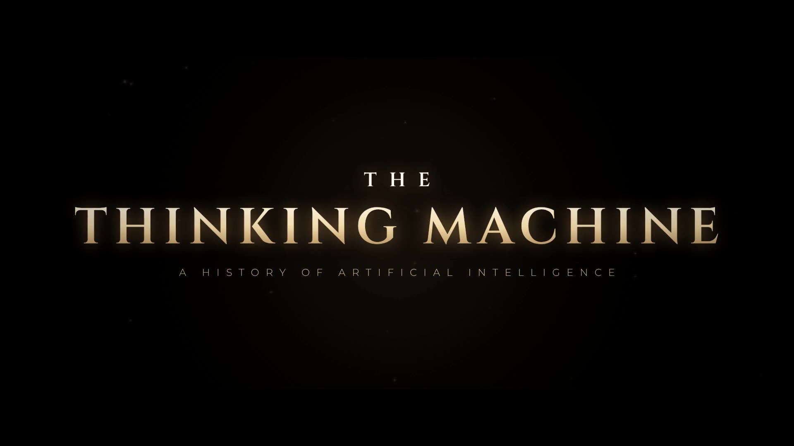

# The Thinking Machine: A History of Artificial Intelligence

A 5½-minute cinematic short film about the history of AI, from Greek myths of
bronze giants to machines that write code and win olympiad gold.



**▶ Watch: [`output/the-thinking-machine.mp4`](output/the-thinking-machine.mp4)**
(1920×1080, 30 fps, 2.39:1 letterbox, stereo; English subtitles and chapter
markers are embedded, and also provided as [`the-thinking-machine.srt`](output/the-thinking-machine.srt)).

The whole film is generated by code. There is no stock footage, stock music,
or recorded voice:

| Layer | How it is made |
| --- | --- |
| **Pictures** | Every frame is drawn on an HTML5 canvas (`film/`) as a pure function of time, then captured by headless Chromium in parallel. |
| **Narration** | Written in [`story.json`](story.json) and spoken by the open-source [Kokoro-82M](https://github.com/thewh1teagle/kokoro-onnx) text-to-speech model (voice `af_heart`). Every line was checked with speech recognition. |
| **Music & sound** | Synthesized from raw waveforms with numpy/scipy (`tools/score.py`): strings, choir, felt piano, music box, braams, risers, drums, and 580+ effects (typewriters, teletypes, chess pieces, Go stones, wind, frost) cued from the picture timeline. |
| **Mix** | Two-band ducking under the voice, hall and room reverbs, and loudness normalization to −16 LUFS (ITU-R BS.1770). |

## Chapters

| Time | Chapter |
| --- | --- |
| 0:00 | Prologue: Can Machines Think? |
| 0:25 | The Ancient Dream |
| 0:46 | 1943 · The Artificial Neuron |
| 1:00 | 1950 · The Imitation Game |
| 1:12 | 1956 · A Field Is Born |
| 1:35 | 1958 · The Perceptron |
| 1:52 | 1966 · ELIZA |
| 2:08 | The AI Winters |
| 2:30 | The Believers |
| 2:49 | 1997 · Deep Blue |
| 3:05 | 2012 · The Deep Learning Revolution |
| 3:30 | 2016 · AlphaGo and Move 37 |
| 3:59 | 2017 · Attention Is All You Need |
| 4:15 | 2018–2022 · Scale, and ChatGPT |
| 4:37 | The Present |
| 5:02 | Epilogue: A New Question |
| 5:23 | Credits |

## How it fits together

```
story.json ──► tools/narrate.py ──► build/vo/*.wav (+ durations)
     │                                   │
     └──────────► film/ (canvas engine + scenes) ◄──┘   timeline: scenes are laid
                     │                                   out around the narration
        tools/render.mjs ──► build/frames/*.jpg + build/timeline.json (sound cues)
                                                    │
                           tools/score.py ◄─────────┘ ──► build/mix.wav, subtitles, chapters
                                                    │
                           ffmpeg (tools/build.sh) ──► output/the-thinking-machine.mp4
```

The picture and the sound share one timeline. Scene lengths come from the
narration, and each scene declares its own sound cues. A typed character, a Go
stone landing or a chart bar dropping in is therefore always in sync with its
sound.

## Build it yourself

Requirements: Python 3.10+, Node 18+, and Chromium via Playwright (about 2 GB
of free disk for the frames).

```bash
pip install -r requirements.txt
npm install                       # Playwright
npx playwright install chromium   # skip if a Chromium is already configured
bash tools/fetch_models.sh        # Kokoro TTS model (~350 MB)
bash tools/build.sh               # ~10 minutes on 4 cores
```

Useful while editing:

```bash
node tools/snap.mjs --scene alphago 12   # contact sheet of one scene
node tools/snap.mjs 225.5                # a single full-size frame
node tools/render.mjs --from 180 --to 190  # re-render a time range
```

To watch a real-time preview in a browser, serve the folder (for example
`npx http-server .`) and open `film/index.html`. It plays the built soundtrack
from `build/mix.wav`.

## Historical notes

The narration simplifies, but the facts and quotations on screen follow the
sources:

- **1843:** Ada Lovelace, *Notes* on Menabrea's sketch of the Analytical Engine (Note A: "…weaves algebraical patterns just as the Jacquard-loom weaves flowers and leaves").
- **1943:** McCulloch & Pitts, "A Logical Calculus of the Ideas Immanent in Nervous Activity", *Bulletin of Mathematical Biophysics*.
- **1950:** A. M. Turing, "Computing Machinery and Intelligence", *Mind* LIX (236). The page and the Forth Bridge exchange are quoted from the paper.
- **1956:** McCarthy, Minsky, Rochester & Shannon, *A Proposal for the Dartmouth Summer Research Project on Artificial Intelligence* (31 August 1955).
- **1958:** Rosenblatt's Perceptron. The headline is from the *New York Times*, 8 July 1958.
- **1966:** Weizenbaum, "ELIZA", *Communications of the ACM*. The secretary anecdote is from his book *Computer Power and Human Reason* (1976).
- **1969–1993:** Minsky & Papert's *Perceptrons* (1969); the Lighthill Report (1973); the expert-systems era (the rule shown is in the style of MYCIN); the AI winters.
- **1986 / 1989:** Rumelhart, Hinton & Williams, *Nature*; LeCun et al., handwritten ZIP-code recognition at Bell Labs.
- **1997:** Deep Blue beat Kasparov 3½–2½ (11 May 1997).
- **2012:** AlexNet won ILSVRC with a 15.3% top-5 error, against 26.2% for the runner-up. The chart shows the winning entry each year.
- **2016:** AlphaGo beat Lee Sedol 4–1. Its policy network put Move 37 of Game 2 at about 1 in 10,000 for a human player.
- **2017:** Vaswani et al., "Attention Is All You Need", NIPS 2017.
- **2018–2022:** GPT-1 (117M parameters), GPT-2 (1.5B), GPT-3 (175B); ChatGPT launched 30 November 2022.
- **2020–2025:** AlphaFold. The 2024 Nobel Prizes in Physics (Hopfield, Hinton) and Chemistry (Baker, Hassabis, Jumper). Gold-medal-level results at the 2025 International Mathematical Olympiad.

## Credits and licenses

- Narration voice: Kokoro-82M (Apache-2.0).
- Typefaces (SIL Open Font License, in `film/fonts/`): Cinzel, Cormorant Garamond, Montserrat, Courier Prime, VT323, IBM Plex Mono. Emoji: Noto Color Emoji.
- Made with [Claude Code](https://claude.com/claude-code).
