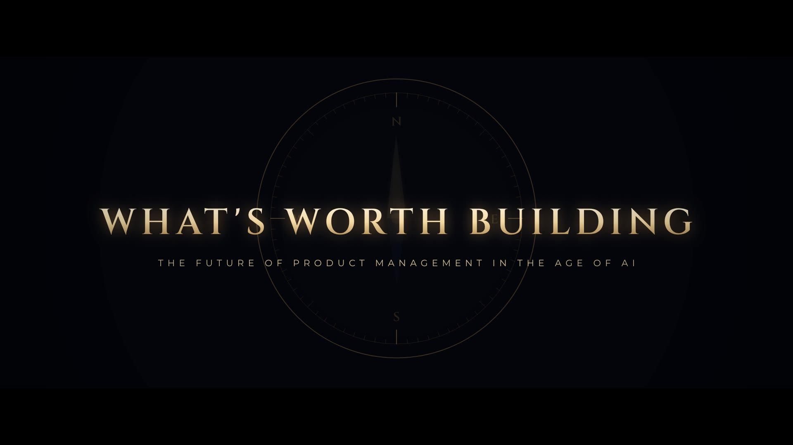

# What's Worth Building: The Future of Product Management in the Age of AI

A 9-minute cinematic short film for aspiring product managers. It asks what is
left for the product manager when AI can draft the spec, synthesize the
research and write the code, and then answers:

- **The future:** three horizons (AI now, AGI possibly, ASI speculatively) and
  what each one does to product work.
- **The verdict:** yes, product management is still a great career, but not
  the old version of the job.
- **The super level:** seven layers of skill crowned by judgment × learning
  speed, plus a knowledge map.
- **The path:** a four-stage roadmap, seven habits, and four doors into the
  profession.



**▶ Watch: [`output/whats-worth-building.mp4`](output/whats-worth-building.mp4)**
(1920×1080, 30 fps, 2.39:1 letterbox, stereo). English subtitles and chapter
markers are embedded, and the subtitles are also provided as
[`whats-worth-building.srt`](output/whats-worth-building.srt).

**📖 Read: [`GUIDE.md`](GUIDE.md)**, the full written companion. It covers every
skill layer in detail (why it matters, what "super" looks like, how to
practise it, what to put in a portfolio), the knowledge map, the month-by-month
roadmap with project ideas, a quarterly self-check, a reading list and a
glossary of AI terms.

## Chapters

| Time | Chapter |
| --- | --- |
| 0:00 | Prologue: What Is Left for the Product Manager? |
| 0:27 | Part I · Three Horizons: AI, AGI, ASI |
| 1:15 | What AI Already Does to PM Work |
| 1:51 | When Building Gets Cheap, Judgment Gets Expensive |
| 2:09 | The AGI Horizon: Orchestrating Intelligence |
| 2:40 | The ASI Horizon: What Should Exist? |
| 3:08 | Part II · The Verdict: Is PM Still a Good Career? |
| 3:55 | Part III · The Super PM: Seven Layers of Skill |
| 6:21 | The Knowledge Map |
| 6:57 | Part IV · The Path: A Four-Stage Roadmap |
| 8:00 | Seven Habits of a Resilient PM |
| 8:21 | How to Break In |
| 8:44 | Epilogue: Keep Getting Wiser |
| 9:05 | Credits |

## How it is made

The whole film is generated by code. There is no stock footage, stock music or
recorded voice.

| Layer | How it is made |
| --- | --- |
| **Pictures** | Every frame is drawn on an HTML5 canvas (`film/`) as a pure function of time, then captured by headless Chromium in parallel. Shared visual pieces (icons, panels, chips, ridgelines, the compass, part cards) live in `film/kit.js`. |
| **Narration** | Written in [`story.json`](story.json) and spoken by the open-source [Kokoro-82M](https://github.com/thewh1teagle/kokoro-onnx) text-to-speech model (voice `af_heart`). Every line was checked with speech recognition. On-screen text is timed to the words as they are spoken. |
| **Music and sound** | Synthesized from raw waveforms with numpy/scipy (`tools/score.py`). The score is in E minor and resolves to E major at the end. In Part III, each skill layer adds a new voice to the arrangement, and the roadmap climbs with a walking pulse and a journey theme toward a sunrise. About 200 sound cues (data swarms, card flips, a brass compass, stone slabs, flags, doors, wind) are driven by the picture timeline. |
| **Mix** | Two-band ducking under the voice (every narration line sits at least 8 dB above the music in the speech band), hall and room reverbs, and loudness normalization to −16 LUFS (ITU-R BS.1770). |

```
story.json ──► tools/narrate.py ──► build/vo/*.wav (+ durations)
     │                                   │
     └──────────► film/ (canvas engine + scenes) ◄──┘   scenes are laid out
                     │                                   around the narration
        tools/render.mjs ──► build/frames/*.jpg + build/timeline.json (sound cues)
                                                    │
                           tools/score.py ◄─────────┘ ──► build/mix.wav, subtitles, chapters
                                                    │
                           ffmpeg (tools/encode.sh) ──► output/whats-worth-building.mp4
```

## Build it yourself

Requirements: Python 3.10+, Node 18+, and Chromium via Playwright (about 2 GB
of free disk for the frames).

```bash
pip install -r requirements.txt
npm install                       # Playwright
npx playwright install chromium   # skip if a Chromium is already configured
bash tools/fetch_models.sh        # Kokoro TTS model (~350 MB)
bash tools/build.sh               # ~25 minutes on 4 cores
```

Useful while editing:

```bash
node tools/snap.mjs --scene stack 16       # contact sheet of one scene
node tools/snap.mjs 313.3                  # a single full-size frame
node tools/render.mjs --from 417 --to 481  # re-render a time range
python3 tools/score.py                     # re-synthesize the soundtrack
bash tools/encode.sh                       # re-encode

# a smaller copy for sharing (about 29 MB)
SCALE=1280:720 VBITRATE=320k ABITRATE=96k GOP=240 POSTER=0 \
  OUT=build/share/whats-worth-building-720p.mp4 bash tools/encode.sh
```

To watch a real-time preview in a browser, serve the folder (for example
`npx http-server .`) and open `film/index.html`. It plays the built soundtrack
from `build/mix.wav`.

## Credits and licenses

- Narration voice: Kokoro-82M (Apache-2.0).
- Typefaces (SIL Open Font License, in `film/fonts/`): Cinzel, Cormorant
  Garamond, Montserrat, IBM Plex Mono, Courier Prime, VT323.
- Companion film: [The Thinking Machine](../ai-history-video/), a history of AI.
- Made with [Claude Code](https://claude.com/claude-code).
